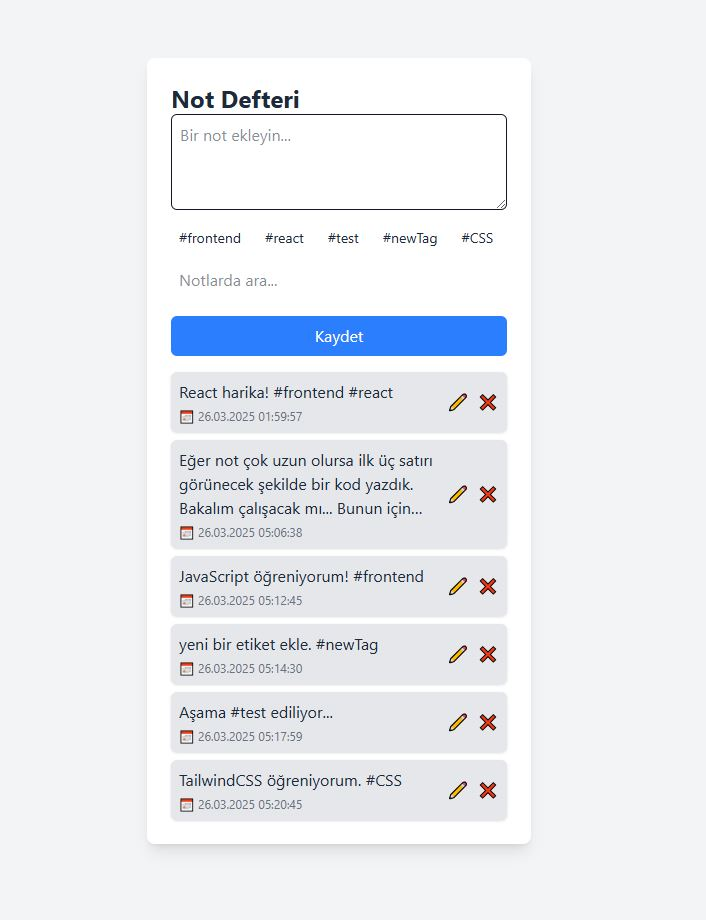
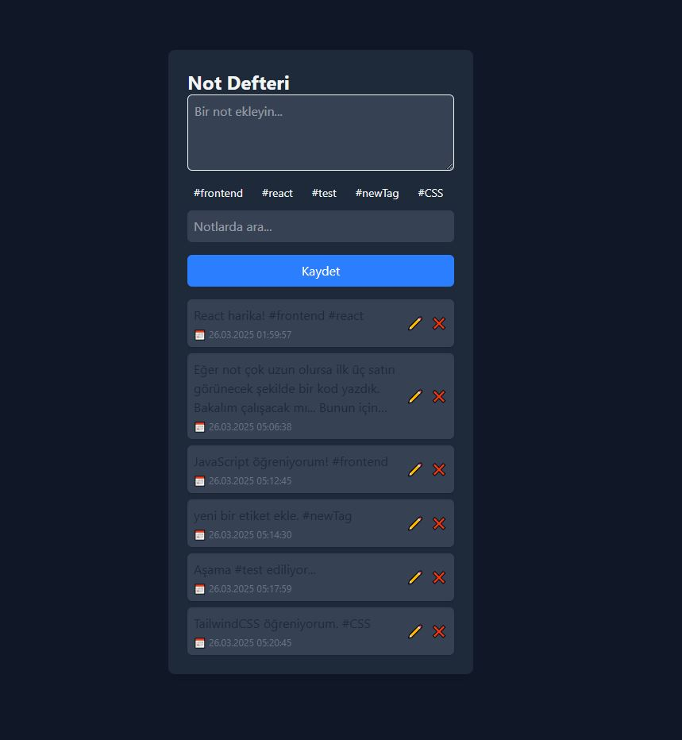

# 📝 Note App   

Bu uygulama, yerel depolama (localStorage) ile çalışan bir **not alma uygulamasıdır**.   
Notlarınızı kaydedin, etiketleyin, arayın ve yönetin. Koyu mod desteği ile her ortamda kullanıma uygun!   

## ✨ Özellikler   

- 📝 Not ekleme, düzenleme ve silme   
- 🌙 Karanlık/Aydınlık tema desteği (otomatik mod algılama)   
- 🔖 Etiket tanıma (#etiket) ve etiketlere göre filtreleme   
- 🔍 Notlarda metin ve etiket arama   
- 🧠 Akıllı filtre sıfırlama özelliği (toggle tag filtre)   
- 🕓 Notlara tarih/saat ekleme   
- 💾 Tarayıcıda kalıcı veri (localStorage)   

## 🛠️ Kullanılan Teknolojiler   

- **HTML5**   
- **Vanilla JavaScript**   
- **Tailwind CSS (v4)**   

## 📸 Ekran Görüntüleri   

| Tema | Görsel |   
|------|--------|   
| Açık Tema |  |   
| Koyu Tema |  |   

## 🔧 Kurulum   

1. Bu repoyu klonlayın:   

```bash   
git clone https://github.com/kullanici-adi/note-app.git   
cd note-app   
```   

2. Gerekli paketleri kurun ve Tailwind CSS’i build edin:   

```bash   
npm install   
npx tailwindcss -i ./src/input.css -o ./src/output.css --watch   
```   

3. index.html dosyasını tarayıcınızda açarak uygulamayı kullanmaya başlayın.   

## 📌 Not   

- Uygulama tamamen tarayıcı üzerinde çalışır. Herhangi bir sunucu ya da veritabanına ihtiyaç yoktur.   

- Karanlık mod için sistem teması algılanır. (Tailwind’de media mode kullanıldı.)   

## 🛡️ Lisans   

Bu proje [MIT lisansı](./LICENSE) ile lisanslanmıştır.   

## 👨‍💻 Geliştirici   

Engin YZ   

---
